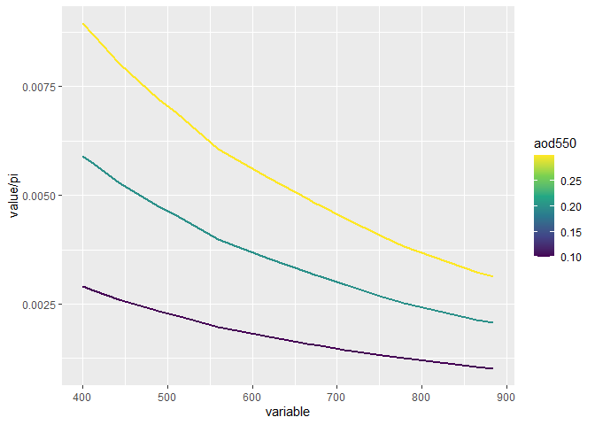

<!-- README.md is generated from README.Rmd. Please edit that file -->

# rsutlis

<!-- badges: start -->

<!-- badges: end -->

The goal of rsutlis is to help me use `rsutlis`.

## Installation

You can install the released version of `rsutlis` from
[GitHub](www.github.com/bishun945/rsutlis)

``` r
remotes::install_github("bishun945/rsutlis")
```

## Example of `points_over_rasters`

This is a basic example which shows you how to do match-up:

``` r
library(raster)
#> Warning: package 'raster' was built under R version 3.6.3
#> Loading required package: sp
#> Warning: package 'sp' was built under R version 3.6.3
library(rsutlis)
f <- system.file("external/test.grd", package="raster")
im <- raster(f)
pts <- data.frame(name = 1:3,
                  lon = c(5.73576, 5.73747, 5.74089),
                  lat = c(50.97330, 50.96790, 50.97942))
result <- points_over_rasters(im, pts)
```

## Example of `run_simulate_aod`

This is a basic example which shows you how to simulate aerosol
reflectance via 6s model:

``` r
library(ggplot2)
#> Warning: package 'ggplot2' was built under R version 3.6.3
result <- run_simulate_aod(aod550_arr = seq(0.1, 0.3, 0.1))
#> 400 0.1 0.13853 0.00911 0.138
#> 400 0.2 0.13853 0.01853 0.14611
#> 400 0.3 0.13853 0.02812 0.15405
#> 413 0.1 0.12333 0.00883 0.12413
#> 413 0.2 0.12333 0.01796 0.13233
#> 413 0.3 0.12333 0.02726 0.14037
#> 443 0.1 0.09302 0.00818 0.09601
#> 443 0.2 0.09302 0.01664 0.10405
#> 443 0.3 0.09302 0.02527 0.11199
#> 490 0.1 0.06182 0.00732 0.0662
#> 490 0.2 0.06182 0.0149 0.0735
#> 490 0.3 0.06182 0.02264 0.08081
#> 510 0.1 0.05249 0.007 0.05727
#> 510 0.2 0.05249 0.01426 0.06433
#> 510 0.3 0.05249 0.02167 0.07142
#> 560 0.1 0.03567 0.00616 0.04076
#> 560 0.2 0.03567 0.01255 0.0471
#> 560 0.3 0.03567 0.01907 0.05347
#> 620 0.1 0.02343 0.00548 0.02846
#> 620 0.2 0.02343 0.01114 0.03414
#> 620 0.3 0.02343 0.01693 0.03986
#> 665 0.1 0.01756 0.005 0.02233
#> 665 0.2 0.01756 0.01017 0.02752
#> 665 0.3 0.01756 0.01544 0.03274
#> 674 0.1 0.01664 0.00492 0.02135
#> 674 0.2 0.01664 0.00999 0.02644
#> 674 0.3 0.01664 0.01517 0.03157
#> 681 0.1 0.0159 0.00484 0.02055
#> 681 0.2 0.0159 0.00984 0.02557
#> 681 0.3 0.0159 0.01494 0.03061
#> 709 0.1 0.01342 0.00455 0.01788
#> 709 0.2 0.01342 0.00925 0.0226
#> 709 0.3 0.01342 0.01403 0.02735
#> 754 0.1 0.01051 0.00414 0.01466
#> 754 0.2 0.01051 0.00839 0.01896
#> 754 0.3 0.01051 0.01271 0.02329
#> 779 0.1 0.00914 0.00392 0.01309
#> 779 0.2 0.00914 0.00793 0.01715
#> 779 0.3 0.00914 0.01201 0.02125
#> 865 0.1 0.00599 0.00332 0.00933
#> 865 0.2 0.00599 0.00671 0.01271
#> 865 0.3 0.00599 0.01014 0.01616
#> 885 0.1 0.00546 0.00321 0.00878
#> 885 0.2 0.00546 0.00649 0.01208
#> 885 0.3 0.00546 0.00981 0.01542
ref_aerosols <- result$spec_aerosols
tmp <- reshape2::melt(ref_aerosols, id=c("aod550"))
tmp$variable <- as.numeric(as.vector(tmp$variable))
ggplot(data = tmp) + 
  geom_path(aes(x = variable, y = value / pi,
                group = aod550, color = aod550), size=1) + 
  scale_color_viridis_c()
```


